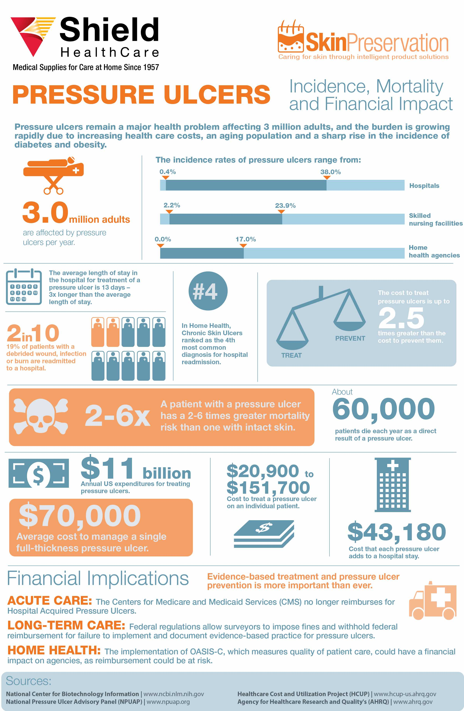
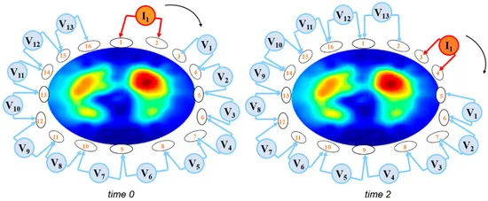
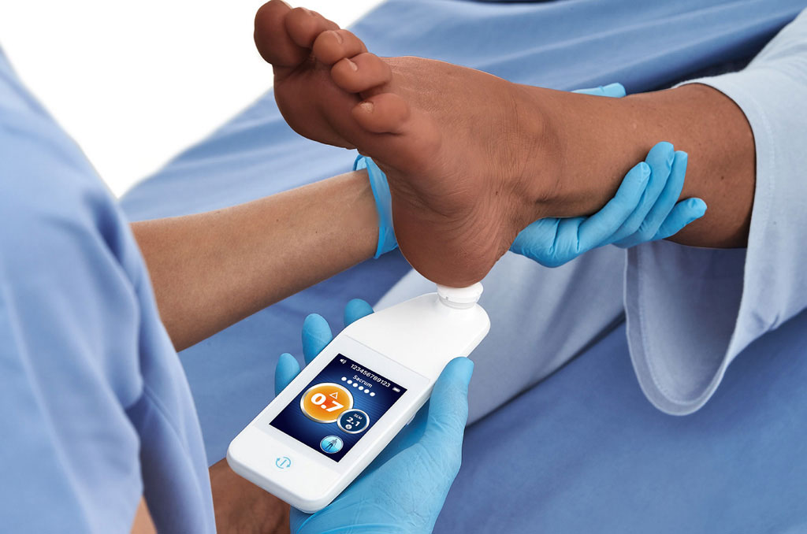
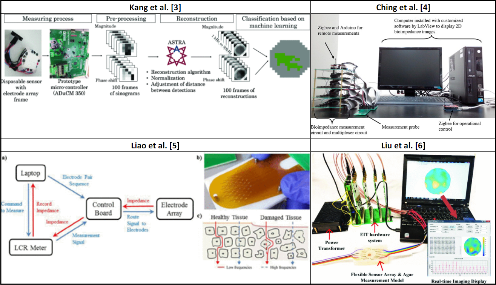

<!-- > reference the files, folders, & report to write this. it really shouldn't take more than an hour.  -->

<!--   -->

## Introduction

This fall, I took an awesome class called ***Biomedical Instrumentation*** ([ECE 4781](https://ece.gatech.edu/courses/ece4781)) with [Dr. Omar Inan](https://ece.gatech.edu/directory/omer-t-inan). And for the final project, my team built a sensor that detects *subcutaneous* (under-the-skin) pressure ulcers! The golden dots placed hexagonally you see in the green, rectangular PCB are surface electrodes, from which we measure bioimpedance. 

You might think, "Wait, that seems like a lot of electrodes!", and you'd be right. We are using an analog multiplexer (in fact, *four* of them) to quickly switch the routes connected to the terminals of the impedance measurement chip, in order to measure the impedance between all combination of nearest-neighbors (42 measurements in total!) pseudo-simultaneously. Finally, we track the location of each pair along with the recorded values, and then process the data in Python to create these beautiful heatmap visualizations to identify regions where cells are damaged. 
<!-- Isn't that cool?  -->

<!--  -->
<!-- Electrode details. -->
<!-- 
 Electrode details. 
 -->

<!--  -->
<!-- Testing procedure. -->
<!-- 
 Testing procedures. 
 -->

<!--  -->
<!-- Test on human skin with lotion. -->
<!-- 
 Test on human skin with lotion. 
 -->

We built **everything from scratch** aside from the Arduino board and ICs! Isn't that cool?!

### Gallery

<!-- [`TODO` photo gallery module kinda like Hackaday, maybe use mouseovers slight-ish (30%) zoom and grid instead of row-list (that's too naive I don't like)] -->

 Finished sensor on a breadboard. 

 
<!-- Finished sensor on a breadboard. -->

 System diagram. 

 
<!-- System diagram. -->

 Electrode details. 

 
<!-- Electrode details. -->

 Electrical schematic. 

 
<!-- Electrical schematic. -->

 Accuracy evaluation of impedance circuit. 

 
<!-- Accuracy evaluation of impedance circuit. -->

 Testing procedure. 

 
<!-- Testing procedure. -->

 Test on burnt pig skin. 

 
<!-- Test on burnt pig skin. -->

 Test on pig skin with lotion. 

 
<!-- Test on pig skin with lotion. -->

 Test on human skin with lotion. 

 
<!-- Test on human skin with lotion. -->

 

# Choosing the Problem

<!-- > shortened problem paragraph, with visuals or graphics to show impact -->

<!-- ### Searching for Impact -->
### Search for Practical Impact

When we started to look for ideas, we realized that most wearable sensors in literature sound really nice on paper but lack practical implications for the medical community. 

For example, the idea of tracking eye movements using *electrooculogram* (EOG; measuring electrical signals from the eye) sounds really cool! But think about it... what are you going to do with it? (And how is it better than just using a camera? Does the benefits outweigh or justify the costs of research, engineering, and testing—and most importantly, the inherent intrusion and risks of a wearable device—on something as sensitive as your eye?) 

### Pressure Ulcers

It's easy to pick a specific niche with an exciting idea, but sometimes there are classes of problems that don't exactly stand out yet nonetheless have a **tremendous** impact due just to the sheer number of people they affect. Tuns out, *pressure ulcers* are exactly that. It is a widely overlooked problem that causes pain, frustrations, and ultimately 60,000 annual deaths in the US alone [1]. 

<!-- [`TODO` infographic of people affected by pressuer ulcers, healthcare costs, etc] -->
<!--  -->

 
  

 Infographic: the medical impact of pressure ulcers 

### Electrical Impedance Tomography

Many viable solutions exist for any given problem. This applies to everything, but is especially true in context of electromechanical sensors. **Electrical impedance tomography** (**EIT**) is one such method. It involves the collection of impedance values across 2D space and creating a *map* that visually identifies regions of interest. Like this:

💡 If you are wondering what *impedance* is -- [it's a complex sibling](https://electricalbaba.com/difference-between-resistance-impedance/) of electrical resistance.

This is great! If you can perform EIT over regions with a high risk for developing pressure ulcers, clinicians will be quickly able to intervene. In fact, this is similar to how subepidermal moisture (SEM) scanners (the industry-standard device for assessing tissue health and detecting pressure ulcers) operate: a human clinician will gently scan across parts of the skin until an abnormal value is detected. 

 Using a SEM scanner. 

<!-- As with everything (and especially true in context of electromechanical sensors), many viable ways exist for any given task. We decided to focus on usability in point-of-care scenarios: often, it is not viable (and not at all desirable) to have bulky dedicated equipment that cannot be  -->

### State of the Art & Status Quo

One clear drawback of SEM is the need of manually scanning body parts. Given the large number of patients potentially at risk, it is easy to see that performing regular scans are labor-intensive and costly. 

If you could just wear something—hypothetically, if your standard clothings could integrate these functionalities—cases of undetected pressure ulcers will be extremely rare. 

Unlike SEM scanners, EIT devices in the literature always seemed to involve bulky dedicated benchtop devices which carry out multiplexing and instrumentation functions that are huge in both size and cost. Often, this is not viable (and not at all desirable), since they cannot be brought to hospital rooms, let alone patient households. 

 Existing works of electroimpedance tomography. 

### Remote Medicine & Point-of-Care

Note that, remote medicine has recently been on the rise. This is partly due to COVID-19, but also due to the realization that continual monitoring of data allows for better medical diagnosis and decisions, compared to one-off or once-every-X-weeks screening. 

We decided to focus on usability in point-of-care & ubiquitous monitoring scenarios, by creating a complete and portable device that can effectively detect pressure ulcers. 

We wanted to know if these sensors truly required those uber-precise benchtop equipment... or we whether we could recreate all of the necessary functions into a small, portable board to be shipped 

 Accuracy evaluation of impedance circuit. 

### Scratchboard Sketches

### Project Proposal

<iframe width="100%" height="100%" style="aspect-ratio: 16 / 10;" src="https://docs.google.com/document/d/e/2PACX-1vRnpkEDChd78RSiXLo1_tAOYUIe_-XN_sGwqlwlUdzt8zQGAJaADqF1CG18CNUyS6y900dSWlRwSg5Y/pub?embedded=true"></iframe>

 

# Getting Our Hands Dirty

### The Electrode

### Manufacturing

### Breadboard Circuits

### Data Processing

 

# Results

## Presentation

<iframe width="100%" height="100%" style="aspect-ratio: 16 / 9.8;" src="https://docs.google.com/presentation/d/e/2PACX-1vQc0h_eTMK1sjq0zGPLGE5UVSQshGSlIRqjr1SpSIHWqO5kLFMk4J79imsF5u3aJpI0XhALIPXQocJI/embed?start=false&loop=false&delayms=60000" frameborder="0" allowfullscreen="true" mozallowfullscreen="true" webkitallowfullscreen="true"></iframe>

## Report

You can read our final report [here](). 

If you have any suggestions or critique, please let me know in the comments or reach out :D

### Key Takeaways

**Why does this matter? (What's the novelty?)**

- It's non-invasive,
blah blah blah...

# Technologies

- Bioimpedance
- Multidimensional Interpolation
- KiCad
- Python
- Bluetooth

# What I Learned

# Mistakes

# Roadmap

# References

Citations

Graphics

[1] Maynard, J. (2016, April 6). Infographic: The Financial Impact of Pressure Injuries. Shield HealthCare. Retrieved September 29, 2023, from http://www.shieldhealthcare.com/community/wound/2016/04/06/pressure-ulcers-incidence-mortality-financial-impact/

https://sem-scanner.com/provizio-sem-scanner-single-use-sensors-awarded-onto-nhs-supply-chains-tower-5-pressure-area-care-framework/