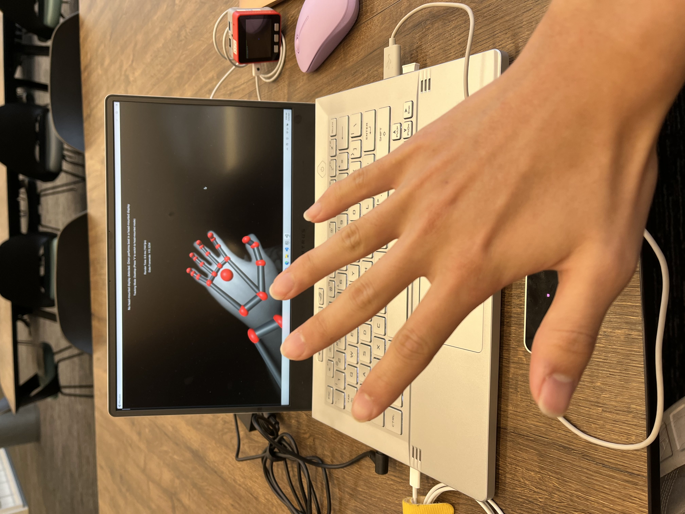
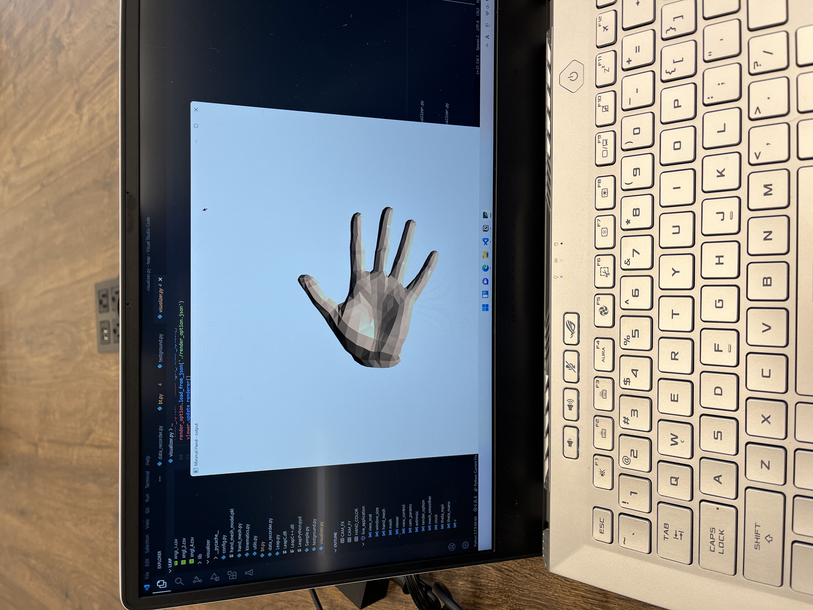
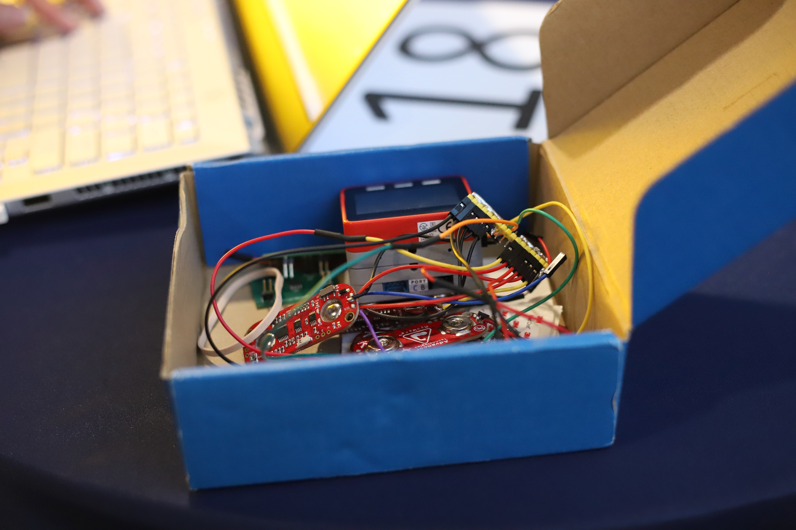
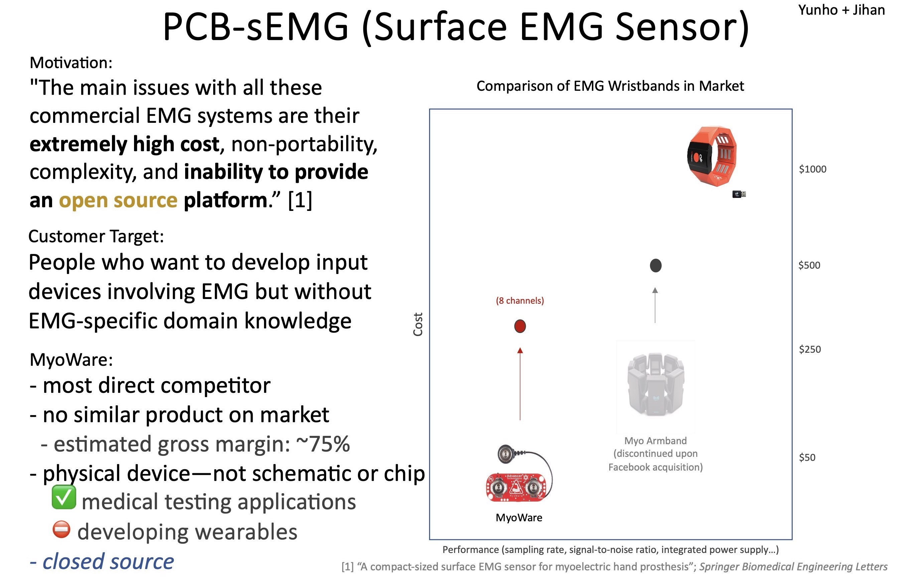
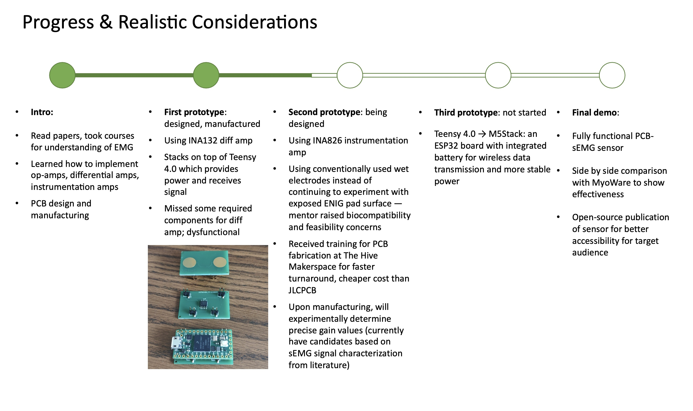
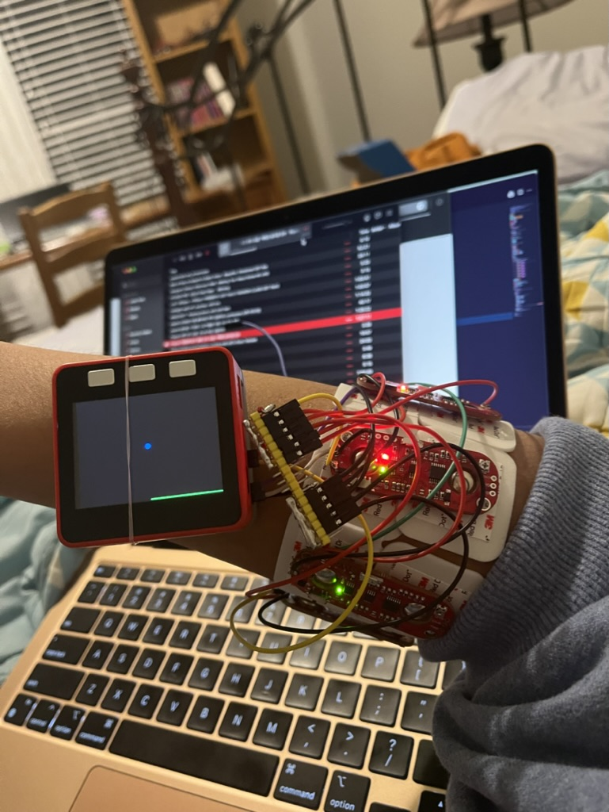
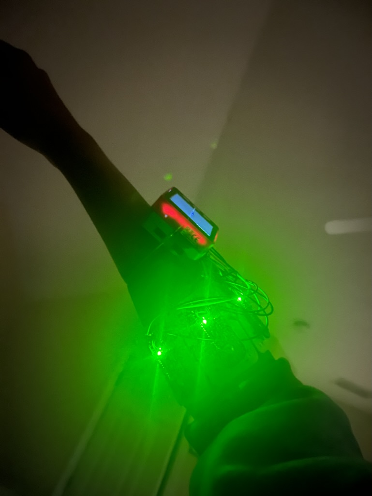

## Introduction

**PCB-EMG** is a wearable muscle activity sensor that is high-performance yet remains extremely affordable. Engineers, developers, and hobbyists can purchase, use, implement, and/or modify PCB-EMG to create non-intrusive yet surreal VR, AR, or human-machine interaction applications. 

**PCB-EMG** is **completely open source**. [Check the GitHub repository here](https://github.com/k2m5t2/PCBsEMG)!

### Gallery

<!--  ENGINEERING STEPS --> 

Hand pose estimation using [Leap Motion](https://leap2.ultraleap.com/leap-motion-controller-2/) hand-tracking controller. 

Hand mesh visualization from joint kinematics parameters using OpenCV.

Prototype in a box :D

Presenting at Georgia Tech's Fall 2021 Idea-to-Prototype Showcase.

**PCB-EMG was awarded #2 overall** with an acceptance to the [Georgia Tech 2022 InVenture Prize]() as a semifinalist!

### Motivation

I have always been passionate in **human-computer interaction** (**HCI**), because it is *one* area that we have never truly revolutionized since inception: computer mice are as old as computers themselves, and if you think about it, keyboards (= typewriters) date back to an even earlier era. Visit the [Buxton Collection](https://www.microsoft.com/buxtoncollection/type.aspx?t=Touch%20Pad) to check some of the most creative input peripherals throughout history, and soon, you'll see what I mean! 

Electromyography (or **EMG**) sensors measure the extremely small voltages that your muscles generate when they are activated. The combination of multiple EMG sensors targeting different muscles with **machine learning** allows you to predict what motion you are making---and even how much force you are exerting to your muscles (even when there's no visible motion!)---something *completely unique to EMG technology*. 

#### Brief History of EMG

Up until 2020, the field of EMG was full of potential and excitements, thanks to a notable company, [Thalmic Labs](https://techcrunch.com/tag/thalmic-labs/), which released a product called the Myo Armband that offered the best-in-class performance with a consumer-level price tag of $250. It was groundbreaking: nearly 4,000 papers that utilize or mention Myo Armband have been published so far, creating some groundbreaking human-computer interaction experiments that were never possible before.

There was just one problem: all the pre-existing EMG sensors were too expensive (especially considering that the technology itself is nothing special---it's just some high-precision instrumentation amplifiers, coupled with meh-grade capacitive electrodes typical in medical clinics), and the literature around how the technology works was very opaque, with almost no public-facing knowledge base that explained how to analyze and implement them, where even academic papers tended to skimp on crucial details in equipment and instrumentation methodologies. This was surprising given: 1) the widespread adoption of open-source practices in areas such as software engineering and additive manufacturing machines i.e., 3D printers, and 2) that EMG has been in existence for decades, with papers being published all the way back from 1970s. 

<!-- `Graph: existing EMG devices in the market` -->

I don't like it when things are unnecessarily expensive, and when the market fail to serve its consumers. There really was no fundamental reason that EMG manufacturers should be charging what they were currently charging (easily upwards of $1,000 per channel). This was just a result of defensive corporate practices and a huge lack of consideration for technology accessibility and education. **And hence, PCB-EMG was born.**

### Goals

**PCB-EMG** seeks to be the **Arduino of EMGs**. This means that it attempts to turn a research-grade technology (with research-grade price tag) into an openly available technology with consumer- and developer-friendly products. How? By 1) dramatically lowering the cost & difficulty of manufacturing processes, 2) creating a public knowledge base of how exactly they work, and 3) creating an ample list of example applications that you can use out-of-the-box. One good word for this process is **democratization**, and it is how `Arduino` and `Raspberry Pi` transformed the worlds of electronics and single-board computing forever---by inviting developers, tinkerers, and hobbyists of all levels to produce all sorts of awesome applications with them---and drove the emergence of Internet-of-Things movement. 

PCB-EMG consists of three main parts: 1) a low-cost, high-performance electrode, 2) a wristband consisting of multiple electrodes, and 3) a complementary machine learning system to support gesture recognition and hand pose estimation tasks. Let's dive deeper, step by step.

### Novelty

The electrode of PCB-EMG takes advantage of [ENIG (electroless nickel plated gold](https://en.wikipedia.org/wiki/Electroless_nickel_immersion_gold); a surface finish that has become a standard in electronics manufacturing) to produce low-cost yet high-performance EMG electrodes. The viability of this approach has been [previously demonstrated](https://www.mdpi.com/1424-8220/19/12/2811). The operating specifics of electrodes are surprisnigly complex. For one, they are not *electric* (or *electronics*) devices; they are **electrochemical** devices that actually interact with the ionic behavior of living cells under your skin. The selection of materials does not only depend on the matter of conductivity and/or impedance, but the electronegative potential or the metals. Secondly, the operating environment of these sensors are not particularly well-suited for some of the materials — metals corrode really fast when exposed to sweat. Thirdly, the voltages produced by your muscles are extremely tiny and require careful electronic design and filtering. **In short: making an electrode is a daunting task.**

the assessment of performance of these electrodes is not straightforward, since 

reading these signals, you can actually

millivolt-level electricity that is generated from your muscle

The goal was to explore using cost-effective manufacturing processes to create affordable EMG (electromyography) electrodes that could be used for prosthesis control or assistive technologies.

# Engineering Process

I am making the knowledge base publicly available for anyone to use ([link to Notion](https://link.yunhocho.com/pcb-emg-kb)). It consists of papers, research projects, prototyping logs, and any other resources that we have found useful in the process. I hope you do too!

### High-Level Overview

parts:
- (6) pcb-emg units
- data collection
- RNN network
- leap motion hand tracking system
- main microcontroller
- main PC & visualization pipeline
- comparison w/ ground truth (quantitative, qualitative)

`TODO into a Figma diagram`

### Literature Review

We started by reading papers. Even though we didn't have inclinations to academia (at least at the time), it was simply the only place that we could find any information. Something we learned soon after starting PCB-EMG: **good papers are hard to come by**, and when you do find that paper that contains everything you've ever wanted to know, sometimes you just cannot make up for the lack of domain knowledge by reading it multiple times. 

`TODO: organized list of good papers (Litmap perhaps)`

Still, we read enough to get a glimpse of the field and how things work. We learned to read jargons such as multi-unit action potential (MUAP; the sum of voltages from a muscle region), wet and dry electrodes (where wet electrodes involve gels to improve interfacial contact), motion artifacts, instrumentation amplifiers (high-gain amplifiers suitable for noisy settings), filters (analog, digital, different types), and else. We learned useful information, such as that MUAPs vary large enough from muscles to muscles that they require orders-of-magnitudes of adjustments, that dry electrodes actually perform better in longer-term scenarios, that no one really talks about detailed methodologies or design choices behind instrumentation circuits and jumps to results and conclusions. 

In the end, we came up with some estimated values of MUAPs. We were ready to prototype. 

### Datasheet, Schematic, PCB Design (V1)

- datasheet study session
- creating the symbols
- bootstrapping w/ Teensy & M5Stack
- validating the schematic
- laying out the board

<object width="100%" height="100%" style="aspect-ratio: 16 / 12;" data="V1 Schematic.pdf"></object>
<object width="100%" height="100%" style="aspect-ratio: 16 / 12;" data="V1 Board.pdf"></object>

### Troubleshooting, Testing, Iteration (V2)

.

### Fabrication & Assembly

- PCB fabrication @ The Hive
- JLCPCB & LCSC (process, challenges & lessons)
- 

### Plan B: MyoWare Sensor

### Programming: ADC, BLE, GUI

### Troubleshooting: Noise, Interference, & Amplifier Saturation

- saturation behavior

### Initial Results: Reactive GUI!

[bar GUI video]

### Data Collection Setup

[`노트나 다이어그램이 있을낀데 흠... 아 대충 figma로 그려도 되지!`]

### Some Fun w/ Machine Learning

[Open Notebook in Colab](https://drive.google.com/file/d/1C8TlWQBE16Vbn-Ujel24_fARzBcbxNqV/view?usp=sharing)

<!--  -->

<iframe width="100%" height="450" src="https://gist.github.com/k2m5t2/3c506fa48eafbdbccf675257b0eaa0d9.js"></iframe>

<Gist gistUrl="https://gist.github.com/k2m5t2/3c506fa48eafbdbccf675257b0eaa0d9"/>
<iframe 
    width="100%"
    height="350"    
    src="data:text/html;charset=utf-8,
    <head><base target='_blank' /></head>
    <body>
    </body>">

### Final Results

.

## Reflection

.

### What I learned

PCB-EMG was my first "real" electronics project. As such, it meant the most trials-and-error encountered in the process. Working on it, I had to learn how to read datasheets (which is intimidating at first, full of unknown jargons, words of caution and warnings), what a typical electronics design workflow looks like (one big mistake was completing a design before realizing that a crucial component was out of stock for a while!), 

