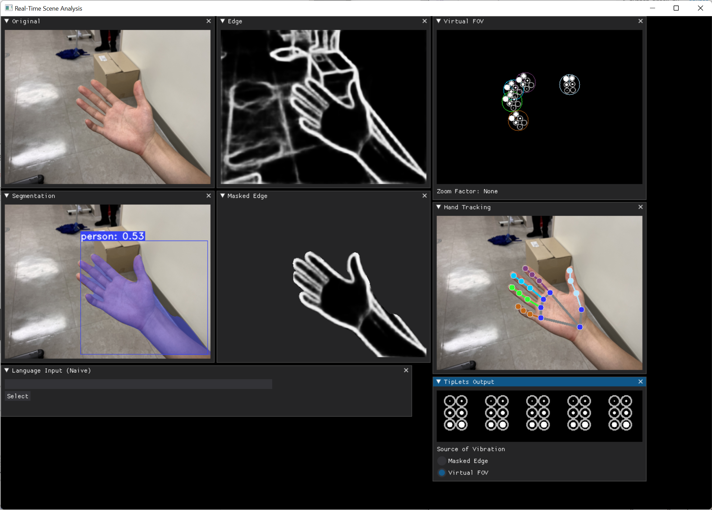

 

# Introduction

`TipLets` & `WristLets` are hardware platforms to help facilitate visual-tactile sensory substitution research. This was created as part of my work as a research intern in Asan Medical Center. 

## Interactive Demonstration

<!-- 
 -->
<!-- 
 -->

    <Canvas>
        <Scene />
    </Canvas>

<!-- [`TODO` illustrative video] -->
<!-- [`TODO` interactive demo] -->

# The Problem

> Tip: Navigate the slide deck using the ←arrow keys→ on your keyboard :)

<iframe 
    width="100%" height="100%" style="border: 1px solid rgba(0, 0, 0, 0.1); aspect-ratio: 16 / 11;"
    src="https://www.figma.com/embed?embed_host=share&url=https://www.figma.com/proto/9DmVKC26vwMIPolsJf9BGe/TipLets-Problems-Deck?type=design&node-id=1-2&t=VLHdaG4mGOneOb0H-1&scaling=contain&page-id=0%3A1&starting-point-node-id=1%3A2&mode=design&hide-ui=1" 
    allowfullscreen 
/>

<!-- `TODOs`
- conceptual mockup in last portion of slides, aesthetic spec-sheet style & illustrations of expected uses & component names
- foldable text block for text version of slides deck
-  -->

 

# The Process

<!--  -->

<!-- [`TODO` embedded flowchart w/ mouseover popups & clickable modals] -->

> Tip: Hover your mouse over each element to see more details :)

<Flowchart />

 

# The Process

<!--  -->

<!-- [`TODO` embedded flowchart w/ mouseover popups & clickable modals] -->

> Tip: Hover your mouse over each stage to see more details :)

### Sensory Overload

One of the foundational challenges in any SSD is *sensory overload*. Just like we use the notion of *resolution* (and sometimes *frame rate*) to denote the information density of visual media, different senses have varying degrees of sensory resolutions. We cannot expect a system that naively transmits all information in maximum bandwidth to "just work" -- which is why I started to work on RTVA, a research dashboard containing efficient implementations of modern computer vision algorithms.

In context of VTSS, the **density of mechanosensory receptors** in the skin determine such sensory resolution. Mechanoreceptors are most densely packed in areas such as tongue and fingertips, which makes sense, given that Braille, a [relatively]() successfuly accessibility medium, uses tactile dots that are read via fingertips. 

We decided to use the Braille system as a proxy (or a baseline) of our exploration, using fingertips as the primary interface as well as the six-dot configuration that Braille users are already familiar with. 

### Intelligent Filtering

To deal with the problem of sensory overload, we decided to employ a number of heuristics to determine the degree of importance of different elements in the field of view. First, we would train an object detection model to recognize common household items, frequently used objects (such as pen, mouse, earbuds), dangerous objects (such as cars, knives, power tools), and people. Then, we would use a segmentation algorithm (think of it as "isolating" or cropping each object within an image) to clean up all the un-important parts. Finally, we would run it through an edge detection algorithm so that it can be conveniently translated into Braille-like tactile signals. 

### Real-Time Visual Analysis

`TODO: RTVA is a link`

Real-Time Visual Analyzer (RTVA) is a simple and modular script written in Python that contains inference-optimized implementations of algorithms such as object detection, instance segmentation, holistic edge detection, hand tracking, facial mesh

### Spatiotemporal Modulation

From a hardware perspective, a TipLet is simply a wireless, battery-powered board with six vibration motors — not a large canvas filled with vibration motors. To let users sense shapes from a "virtual screen", we use the concept of [spatiotemporal modulation](), where the signals are altered in a way that simulates the presence of a large picture made of Braille as users move their hands. 

### Localization

That meant we needed a way to quickly and consistently track the location of each TipLet. This was implemented by using a head-mounted camera that runs a marker tracking algorithm (recognizing the look of an assembled TipLet ) as well as a hand tracking algorithm (as a fallback, in cases when the fingertip is temporarily occluded i.e., when user grabs the hand into a fist). 

### Miniaturization

Fingertips have some of the highest density of mechanoreceptors among various parts of the body. The reason is clear: we use them to interact with the world. Imagine writing with a pen or typing on a keyboard, without being able to sense the subtle chanages in the orientation of the pen or being able to sense when the key has been pressed. 

It was necessary to make Tiplets as small, unobtrusive, and invisible, and comfortable to wear, so that the benefits of being able to read the shapes outweigh the costs of occupying such a valuable sensory real estate. 

Each TipLets measures 3.0 cm * 2.0 cm - comparable to the size of a penny. This includes the haptic actuators, microprocessor, wireless module, and the battery (that would last a couple hours of continual operation). 

### Vibrotactile Interfaces

A large challenge we encountered was the lack of commercial availability for miniature haptic actuators. Turns out, that the #1 factor behind the consumption of vibration motors are smartphones. And because each smartphone only employs one (or two) motors inside it, and the output power of the actuator is proportional to its size, there hgitas not been much effort in miniaturizing it. There was one manufacturer, Vybronics, which produced a unit that measures 5 mm in diameter, but we kept wondering if we could go even smaller — so that we reach the spatial resolution of fingers. 

### MEMA

<video src='./magneticalc.MOV' controls />

I started to consider the possibility of designing and fabricating custom haptic actuators, and ended up spending a full month doing that. 

In literature, I found a series of work referred to as PEMA, p(?) electromagnetic actuators, which achieves exactly this, by using polymer substrate cured with magnetic particles and using liquid metal trapped inside the polyer to as a conductive wire to construct the electromagnetic mechanism. However, as it was an experimental prototype, the structure was too complex for large-scale manufacturing. 

Instead, I realized that is possible to achieve a similar mechanism using the manufacturing processes of flexible printed circuits (FPC), which have thinly deposited layer of copper that remains flexible and polyimide insulating layers, which is also flexible. However, it would be difficult to directly prototype using this process, as the manufacturing lead times are 1-2 weeks and we would need to adjust a bunch of different parameters to find the resonant frequencies. 

Thereby, as a prototype, we considered the viability of creating a small 

`TODO: MEMA is a link` 

### Final Conceptualization & User Needs

### Wireless Operation

### Component Selection

### Motor Driver

### Electrical Schematic

### Printed Circuit Board (PCB)

### Fabrication/Assembly

### Cost

Each unit cost around $5, meaning the entire set of TipLets (each module for each finger) would cost $150 alone for actuators. 

### Design for Manufacturing

### Firmware

### Testing

 

# The Result

`TODOs`
- photos
- exploded 3D layer diagram: PCB, components, motors,...
- interactive 3D mockups

 

# Technologies

- Python -- 
- OpenCV -- Marker Tracking
- KiCad -- Schematics and PCB Design
- FastAPI -- 
- Bluetooth Low Energy -- 
- PyTorch -- 

 

# In Conclusion

Building `TipLets` and `WristLets`, I directly confronted the product development workflow from start to end: (1) investigating the research literature to identify an academic gap, (2) writing an internal proposal with a conceptual device that considers various user needs, (3) learning about specific technical domains, as well as the desirability and availability of off-the-shelf parts (as this was during the chip shortage brought by COVID-19), (4) implementing the device as a fully-assembled PCB, as well as writing the microcontroller's firmware and PC-side monitoring software, and finally, (5) conducting prototypical experiments --- under guidance of [Dr. Daehan Wi]() in [Asan Medical Center](). 

<!--  `TODO` make this shorter, tap into my literary brain from Hackaday era -->

# The Lessons

- **Begin with the end in mind**: 
- **Take advantage of off-the-shelf**: (to gradually scaffold the complexity)
- **Low-fidelity prototyping saves a lot of time**: 
- **'Unit-test' your hardware**: 

# Mistakes

- **Manufacturability**: There was a lot of trouble soldering everything together for TipLets, because the SSOP-22 was deprecated, leaving X as the only option. Now, after creating the designs, I realized that X was just as difficult to solder as the notorious Y package. After unsuccessfully attempting to solder them manually, I eventually gave up and had to get a quote from a  local PCBA firm, which offered an assembly of two sets for $500 (which was far from ideal). There definitely was a possibility to scrap some SSOP packages off of off-the-shelf breakout boards. 
- 

# Roadmap

- 

